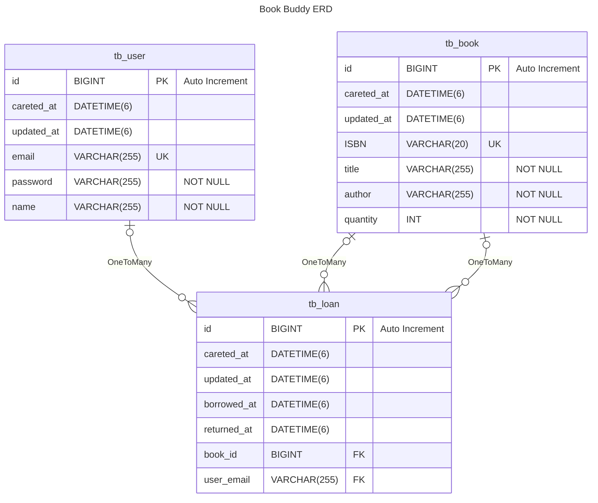

# Book Buddy

## 개발 환경

Java - 17 
Spring boot - 2.7.14 
Spring Data JPA 
MySQL,H2,Junit,Gradle,Swagger 

## 기능 정의서

> 1) _사용자_ 
     - 회원가입
>
> 2) _도서관리_ 
     - 도서를 등록한다 
     - 등록된 도서를 수정한다 
     - 등록된 도서에 대한 대출이력을 확인한다 
     - 아이디를 입력 후 도서에 대한 대출처리를 한다 
     - 도서에 대하여 반납처리한다 

### 사용자

> 회원가입

- [x] 이메일(UK), 비밀번호, 이름으로 회원가입을 할 수 있다. 
- [x] 요청 시 이메일(UK), 비밀번호, 이름은 각각 누락될 수 없다. 
- [x] 회원 가입 시 이메일(UK)은 중복될 수 없다. 

### 도서

> 도서를 등록한다

- [x] ISBN(UK), 제목, 저자, 수량으로 도서를 등록 할 수 있다. 
- [x] 요청 시 ISBN(UK), 제목, 저자, 수량은 각각 누락될 수 없다. 
- [x] 등록 시 ISBN(UK) 은 중복될 수 없다. 

> 등록된 도서를 수정한다

- [x] 등록된 도서의 ISBN(UK), 제목, 저자, 수량은 각각 수정할 수 있다. 
- [x] 요청 시 ISBN(UK), 제목, 저자, 수량은 각각 누락될 수 없다. 
- [x] 수정 시 ISBN(UK) 은 중복될 수 없다. 

> 등록된 도서에 대한 대출이력을 확인한다

- [x] 도서의 번호(PK)로 해당 도서의 대출 이력을 조회할 수 있다. 
- [x] 요청 시 도서의 번호(PK)는 누락될 수 없다. 
- [x] 대출 이력은 가장 최근 대출 내역부터 내림차순으로 정렬한다. 

> 아이디를 입력 후 도서에 대한 대출 처리를 한다

- [x] 유저 이메일(UK)과 도서 번호(PK)로 도서 대출을 할 수 있다. 
- [x] 요청 시 유저 이메일과 도서 번호(PK)를 누락할 수 없다. 
- [x] 유저가 이미 빌린 책의 중복 대출은 허용하지 않는다. 
- [x] 여러 사용자가 동시에 대출 요청을 하더라도 대출이 가능한 도서 수량만큼만 대출할 수 있다. 

> 도서에 대하여 반납처리한다

- [x] 유저 이메일과 도서 번호(pk)로 도서 반납을 할 수 있다. 
- [x] 요청 시 유저 이메일과 도서 번호(PK)를 누락할 수 없다. 
- [x] 이미 반납한 도서는 재 반납이 불가하다. 
- [x] 동시에 여러 반납 요청이 와도 반납 가능한 도서 수만큼만 반납을 허용한다. 

## ERD

## API

##

##