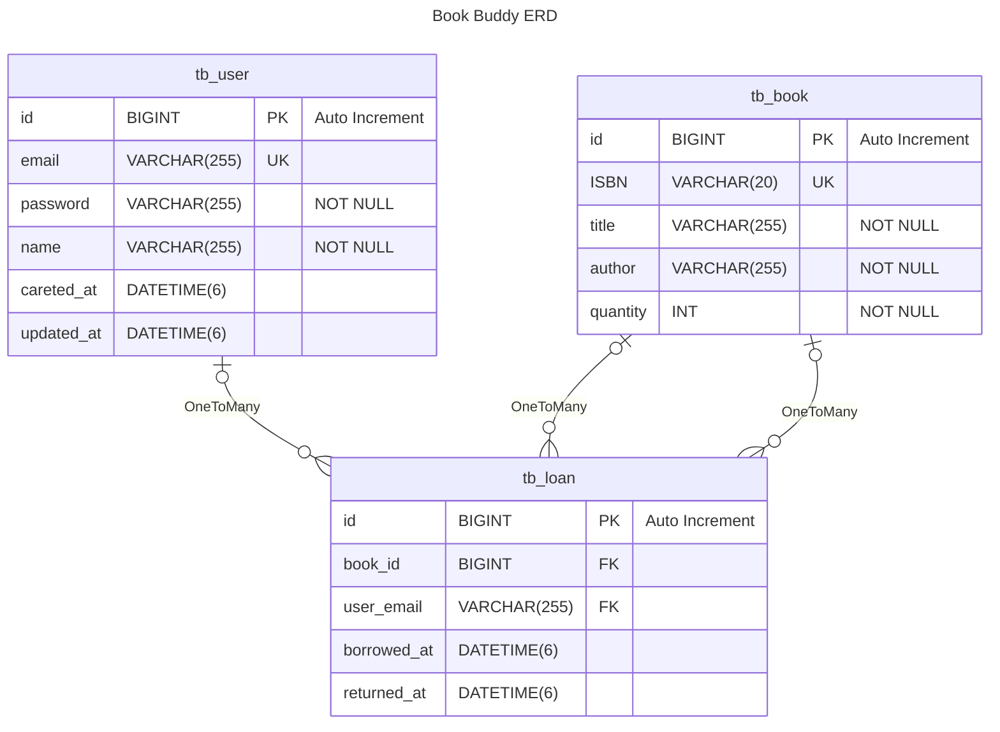

# Book Buddy

## ERD

```mermaid
---
title: Book Buddy ERD
---
erDiagram
    tb_user |o--o{ tb_loan: OneToMany
    tb_book |o--o{ tb_loan: OneToMany
    tb_book |o--o{ tb_loan: OneToMany

    tb_user {
        id BIGINT PK "Auto Increment"
        email VARCHAR(255) UK
        password VARCHAR(255) "NOT NULL"
        name VARCHAR(255) "NOT NULL"
        careted_at DATETIME(6)
        updated_at DATETIME(6)
    }

    tb_book {
        id BIGINT PK "Auto Increment"
        ISBN VARCHAR(20) UK
        title VARCHAR(255) "NOT NULL"
        author VARCHAR(255) "NOT NULL"
        quantity INT "NOT NULL"
    }

    tb_loan {
        id BIGINT PK "Auto Increment"
        book_id BIGINT FK
        user_email VARCHAR(255) FK
        borrowed_at DATETIME(6)
        returned_at DATETIME(6)
    }
```

## API

##  

##